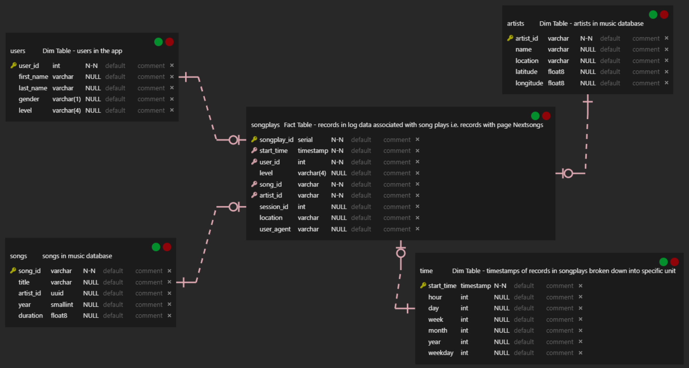

**Introduction**

A startup called **Sparkify** wants to analyze the data they've been collecting on songs and user activity on their new music streaming app. The analytics team is particularly interested in understanding what songs users are listening to. Currently, they don't have an easy way to query their data, which resides in a directory of JSON logs on user activity on the app, as well as a directory with JSON metadata on the songs in their app.

The aim is to create a Postgres Database Schema and ETL pipeline to optimize queries for song play analysis.

**Project Description**

In this project, I have to model data with Postgres and build and ETL pipeline using Python. On the database side, I have to define fact and dimension tables for a Star Schema for a specific focus. On the other hand, ETL pipeline would transfer data from files located in two local directories into these tables in Postgres using Python and SQL

**Schema for Song Play Analysis**

**Fact Table**

**songplays** records in log data associated with song plays

**Dimension Tables**

**users** in the app

**songs** in music database

**artists** in music database

**time**: timestamps of records in songplays broken down into specific units

**Sparkify Database - Fact and Dimensions Tables - Star Schema :**

**Project Design**

Database Design is very optimized because with a few number of tables and doing specific join, we can get the most information and do analysis

ETL Design is also simplified have to read json files and parse accordingly to store the tables into specific columns and proper formatting

**Database Script**

Writing "python create_tables.py" command in terminal, it is easier to create and recreate tables

**Jupyter Notebook**

etl.ipynb, a Jupyter notebook is given for verifying each command and data as well and then using those statements and copying into etl.py and running it into terminal using "python etl.py" and then running test.ipynb to see whether data has been loaded in all the tables

R**elevant Files Provided **

**test.ipnb** displays the first few rows of each table to let you check your database

**create_tables.py** drops and created your table

**etl.ipynb** read and processes a single file from song_data and log_data and loads into your tables in Jupyter notebook

**etl.ipynb** read and processes a single file from song_data and log_data and loads into your tables in ET

**sql_queries.py** containg all your sql queries and in imported into the last three files above